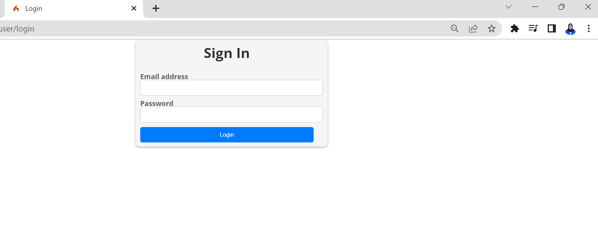
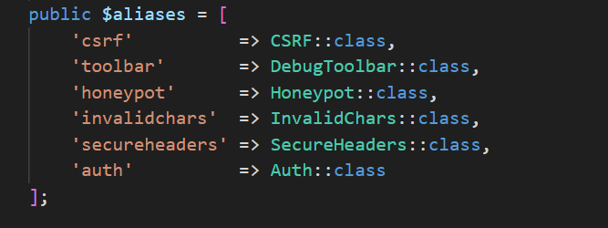
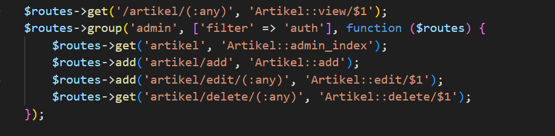

# Tugas Pemograman Web 2
## Profil
| #               | Biodata                |
| --------------- | ---------------------- |
| **Nama**        | Zhafira Abadiningrum   |
| **NIM**         | 312110067              |
| **Kelas**       | TI.21.A.1              |
| **Mata Kuliah** | Pemrograman Web 2      |

# Langkah-langkah & Persiapan
<p>Untuk memulai membuat modul Login, yang perlu disiapkan adalah Database Server
menggunakan MySQL. Pastikan MySQL Server sudah dapat dijalankan melalui XAMPP.</p>

# Membuat Tabel
### Studi Kasus User Login


### Membuat Tabel User

```php
CREATE TABLE user (
id INT(11) auto_increment,
username VARCHAR(200) NOT NULL,
useremail VARCHAR(200),
userpassword VARCHAR(200),
PRIMARY KEY(id)
);
```

# Membuat Model User
<p>Selanjutnya adalah membuat Model untuk memproses data Login. Buat file baru pada direktori
app/Models dengan nama UserModel.php</p>

```php
<?php

namespace App\Models;

use CodeIgniter\Model;

class UserModel extends Model
{
  protected $table = 'user';
  protected $primaryKey = 'id';
  protected $useAutoIncrement = true;
  protected $allowedFields = ['username', 'useremail', 'userpassword'];
}
```

# Membuat Controller User
<p>Buat Controller baru dengan nama User.php pada direktori app/Controllers. Kemudian tambahkan
method index() untuk menampilkan daftar user, dan method login() untuk proses Login.</p>

```php
<?php

namespace App\Controllers;

use App\Models\UserModel;

class User extends BaseController
{
  public function index()
  {
    $title = 'Daftar User';
    $model = new UserModel();
    $users = $model->findAll();
    return view('user/index', compact('users', 'title'));
  }
  public function login()
  {
    helper(['form']);
    $email = $this->request->getPost('email');
    $password = $this->request->getPost('password');
    if (!$email) {
      return view('user/login');
    }
    $session = session();
    $model = new UserModel();
    $login = $model->where('useremail', $email)->first();
    if ($login) {
      $pass = $login['userpassword'];
      if (password_verify($password, $pass)) {
        $login_data = [
          'user_id' => $login['id'],
          'user_name' => $login['username'],
          'user_email' => $login['useremail'],
          'logged_in' => TRUE,
        ];
        $session->set($login_data);
        return redirect('admin/artikel');
      } else {
        $session->setFlashdata("flash_msg", "Password salah.");
        return redirect()->to('/user/login');
      }
    } else {
      $session->setFlashdata("flash_msg", "email tidak terdaftar.");
      return redirect()->to('/user/login');
    }
  }
}
```

# Membuat View Login
<p>Buat direktori baru dengan nama user pada direktori app/views, kemudian buat file baru dengan nama
login.php.</p>

```php
<!DOCTYPE html>
<html lang="en">
<head>
  <meta charset="UTF-8">
  <title>Login</title>
  <link rel="stylesheet" href="<?= base_url('/style.css'); ?>">
</head>
<body>
  <div id="login-wrapper">
    <h1 class="h1-login">Sign In</h1>
    <?php if (session()->getFlashdata('flash_msg')) : ?>
      <div class="alert alert-danger"><?= session()->getFlashdata('flash_msg') ?></div>
    <?php endif; ?>
    <form action="" method="post">
      <div class="mb-3">
        <label for="InputForEmail" class="form-label">Email address</label>
        <input type="email" name="email" class="form-control" id="InputForEmail" value="<?= set_value('email') ?>">
      </div>
      <div class="mb-3">
        <label for="InputForPassword" class="form-label">Password</label>
        <input type="password" name="password" class="form-control" id="InputForPassword">
      </div>
      <button type="submit" class="btn btn-primary">Login</button>
    </form>
  </div>
</body>
</html>
```

# Membuat Database Seeder
- Database seeder digunakan untuk membuat data dummy. Untuk keperluan uji coba modul login, kita
perlu memasukkan data user dan password kedalam database. Untuk itu buat database seeder
untuk tabel user. Buka CLI, kemudian tulis perintah berikut:

```bash
php spark make:seeder UserSeeder
```

- Selanjutnya, buka file UserSeeder.php yang berada di lokasi direktori
/app/Database/Seeds/UserSeeder.php kemudian isi dengan kode berikut:

```php
<?php

namespace App\Database\Seeds;

use CodeIgniter\Database\Seeder;

class UserSeeder extends Seeder
{
    public function run()
    {
        $model = model('UserModel');
        $model->insert([
            'username' => 'admin',
            'useremail' => 'admin@email.com',
            'userpassword' => password_hash('admin123', PASSWORD_DEFAULT),
        ]);
    }
}
```

- Kemudian, buka kembali CLI dan ketik perintah berikut:

```bash
php spark db:seed UserSeeder
```

- Lalu, uji coba login nya dengan cara mengakses url http://localhost:8080/user/login seperti berikut:



# Menambahkan Auth Filter
- Selanjutnya membuat filter untuk halaman Admin. Buat file baru dengan nama Auth.php pada
direktori app/Filters, Kemudian masukan kode berikut:

```php
<?php

namespace App\Filters;

use CodeIgniter\HTTP\RequestInterface;
use CodeIgniter\HTTP\ResponseInterface;
use CodeIgniter\Filters\FilterInterface;

class Auth implements FilterInterface
{
  public function before(RequestInterface $request, $arguments = null)
  {
    // jika user belum login
    if (!session()->get('logged_in')) {
      // maka redirct ke halaman login
      return redirect()->to('/user/login');
    }
  }
  public function after(RequestInterface $request, ResponseInterface $response, $arguments = null)
  {
  }
}
```

- Kemudian buka file app/Config/Filters.php tambahkan kode berikut:

```php
'auth' => App\Filters\Auth::class
```



- Lalu buka file app/Config/Routes.php dan sesuaikan kodenya.


- Dan uji coba akses menu admin, dengan cara buka url dengan alamat http://localhost:8080/admin/artikel ketika alamat tersebut diakses maka akan dimuculkan halaman login.



# Fungsi Logout
<p>Tambahkan method logout() pada Controller User seperti berikut:</p>

```php
  public function logout()
  {
    session()->destroy();
    return redirect()->to('user/login');
  }
```

## Pertanyaan dan Tugas
<p>Selesaikan programnya sesuai Langkah-langkah yang ada. Anda boleh melakukan improvisasi.</p>

## Laporan Praktikum
1. Melanjutkan praktikum sebelumnya pada repository dengan nama Lab8Web.
2. Kerjakan semua latihan yang diberikan sesuai urutannya.
3. Screenshot setiap perubahannya.
4. Update file README.md dan tuliskan penjelasan dari setiap langkah praktikum beserta
screenshotnya.
5. Commit hasilnya pada repository masing-masing.
6. Kirim URL repository pada e-learning ecampus.

## Terima Kasih!
